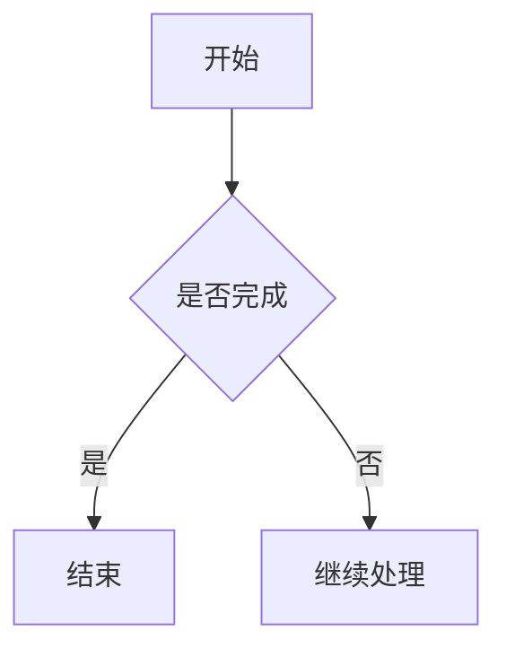

# RegulusApple's Blog

这是 RegulusApple 的个人博客项目，基于 [Hexo](https://hexo.io/) 构建，使用自定义主题 `regulusapples-blog`，通过 GitHub Pages 自动部署。

线上地址：<https://www.regulusapplex.space>

## 技术栈

- Hexo 8.1.2
- Node.js 20+
- EJS
- Markdown-it
- KaTeX 数学公式
- GitHub Actions
- GitHub Pages

## 本地运行

首次使用时安装依赖：

```bash
npm ci
```

启动本地预览：

```bash
npm run dev
```

然后访问 <http://localhost:4000>。

## 常用命令

```bash
# 清理生成目录
npm run clean

# 生成静态网站
npx hexo generate

# 生成并准备可选的 dist 输出
npm run build

# 检查生成结果
npm run verify

# 新建普通文章
npm run new -- "文章标题"

# 新建周记
npm run new:weekly -- "本周记录"
```

## 写文章

普通文章位于：

```text
source/_posts/
```

草稿位于：

```text
source/_drafts/
```

新建文章后，编辑生成的 Markdown 文件即可。文章通常包含以下字段：

```yaml
---
title: 文章标题
date: 2026-09-18
categories:
  - 学习
tags:
  - 记录
description:
toc: true
aside: true
comment: true
---
```

周记使用 `weekly-post` 布局，命令如下：

```bash
npm run new:weekly -- "本周记录"
```

文章中的 Mermaid 图表使用 `mermaid` 代码块，构建后会自动渲染：

````markdown

````

## 项目结构

```text
.
├── .github/workflows/pages.yml  # GitHub Pages 自动部署工作流
├── _config.yml                  # Hexo 主配置
├── source/                      # 页面、文章、图片和资源
│   ├── _posts/                  # 正式文章
│   ├── _drafts/                 # 草稿
│   └── about/                   # 独立页面
├── themes/regulusapples-blog/   # 自定义主题
├── scaffolds/                   # 新文章模板
├── scripts/                     # 辅助脚本
├── tools/                       # 构建和校验工具
├── 素材/                        # 未直接用于页面的设计素材
├── package.json                 # 项目命令和依赖
└── public/                      # Hexo 生成目录，不要手动编辑
```

## 站点配置

当前正式域名配置在 `_config.yml`：

```yaml
url: https://www.regulusapplex.space
root: /
```

修改域名时，需要同时检查 DNS、GitHub Pages 的 Custom domain，以及这里的 `url` 配置。

## 发布到 GitHub Pages

本项目使用 GitHub Actions 发布，不需要手动上传 `public/`。

完成修改后执行：

```bash
git status
git add .
git commit -m "描述这次修改"
git push origin main
```

推送到 `main` 后，GitHub Actions 会自动执行：

1. 安装依赖；
2. 生成 Hexo 静态文件；
3. 校验生成结果；
4. 发布到 GitHub Pages。

可以在仓库的 **Actions** 页面查看部署状态。只有工作流显示成功后，线上网站才会更新。

## Git 常用流程

开始工作前：

```bash
git switch main
git pull --ff-only origin main
```

完成修改后：

```bash
git status
git diff
git add .
git commit -m "描述这次修改"
git push origin main
```

查看最近提交：

```bash
git log --oneline --decorate -10
```

查看远程仓库：

```bash
git remote -v
```

正式 GitHub 远程仓库是：

```text
https://github.com/RegulusApple/RegulusApples-blog.git
```

## 注意事项

- 不要直接修改 `public/`，它会在生成网站时被重新创建。
- 不要把 `node_modules/`、`db.json` 或本地缓存提交到仓库。
- 修改文章后先运行 `npm run dev` 本地预览。
- 推送前确认当前分支是 `main`，远程仓库是 `origin`。
- 如果 GitHub Actions 失败，先查看 Actions 中具体失败的步骤，再修改项目。
