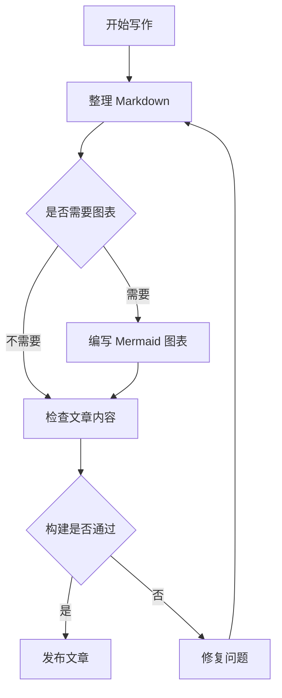

这是一篇用于测试 Mermaid 支持的文章。以后写流程、拆解项目或记录实验步骤时，可以直接把 Mermaid 代码放进 Markdown 代码块中。

## 一个简单的文章发布流程

下面这张图展示了从写作到发布的大致流程：

```mermaid
flowchart TD
  A[开始写作] --> B[整理 Markdown]
  B --> C{是否需要图表}
  C -->|需要| D[编写 Mermaid 图表]
  C -->|不需要| E[检查文章内容]
  D --> E
  E --> F{构建是否通过}
  F -->|是| G[发布文章]
  F -->|否| H[修复问题]
  H --> B
```

## 使用方式

只需要把图表代码放在 `mermaid` 代码块中，构建博客后就会自动渲染。切换浅色和深色主题时，图表也会跟着重新适配。
